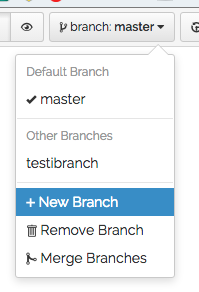

Hyppylentotoiminnan ohjeistus
======

Tämä on Laskuvarjotoimikunnan hyppylentotoimintatyöryhmän ohjeistustyö.

Muutoksien tekeminen
======

Kun haluat tehdä muutoksia, tee ne Gitbook.comin editorilla. Mikäli sinulla ei ole tunnuksia Gitbookiin, pyydä kutsu Laskuvarjotoimikunnalta.

Jokainen muutos tehdään omaan haaraan (branch).

Toimintaohjeet:
1. Klikkaa branch-valikosta: 
2. Valitse New Branch
3. Anna branchille kuvaava nimi
4. Uusi branch on nyt luotu, näet että se on valittuna branch-valikossa
5. Tee muutokset haluamaasi kohtiin
6. Kun olet sitä mieltä, että tekemäsi osuus on nyt valmis, yhdistä (merge) se master-branchiin - vain ne tiedostot (artikkelit), johon olet tehnyt muutoksia, päivittyvät masterille

