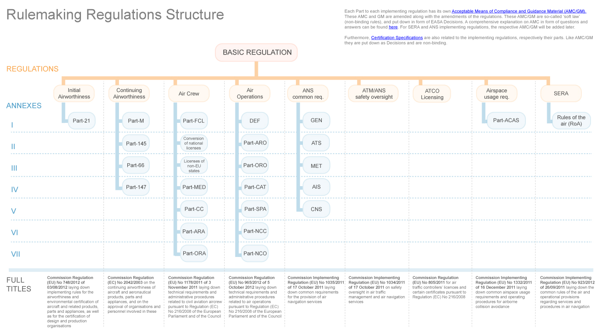

# Määräysympäristö

##Yleistä

Laskuvarjohyppylentotoimintaa säädellään paitsi kansallisesti, niin enenevässä määrin myös EU-lainsäädännöllä. Hyppylentotoiminnan määräys- ja vaatimusympäristö koostuu paitsi yleisesti lentotoimintaa koskevista määräyksistä (esim. määräykset lentäjien lupakirjoista tai lentokoneiden huoltamisesta), niin myös spesifisesti laskuvarjohyppylentotoimintaa koskevista säännöistä (kuten vaikkapa laskuvarjohyppylennoilla edellytettävät varusteet).

Lentäminen on yleisesti ottaen hyvin yksityiskohtaisesti säädeltyä verrattuna moneen muuhun toimintaan. Esim. tavanomaisten laskuvarjohyppytoimintaan käytettävien lentokoneiden huoltotoiminta on huomattavasti tarkemmin säädeltyä kuin vaikkapa autojen huoltaminen.

###Kansalliset määräykset

Suomessa ilmailua säädellään ilmailulailla sekä Liikenteen Turvallisuusvirasto Trafin antamilla määräyksillä. Lentotoimintaa koskevat kansalliset määräykset ovat kuitenkin suurelta osin korvautumassa EU:n yhteisillä lentotoimintaa koskevilla vaatimuksilla. Esim. laskuvarjohyppylentotoimintaa koskevien EU-määräysten odotetaan korvaavan kansalliset määräykset vuoden 2017 aikana.

Ilmailulaki sisältää laskuvarjohyppylentojen suorittamisen osalta joitakin keskeisiä määritelmiä. Ilmailulaissa määritellään laskuvarjohyppylentojen olevan lentotyötä. Lentotyöllä tarkoitetaan ilma-aluksen käyttämistä erikoistehtäviin. Osa lentotyötoiminnasta edellyttää Trafin myöntämää toimilupaa, mutta esim. laskuvarjohyppylennot on tästä vaatimuksesta vapautettu.

Liikenteen Turvallisuusvirasto Trafi julkaisee toimivaltansa puitteissa ilmailua koskevia viranomaismääräyksiä.

Tällä hetkellä hyppylentotoimintaa koskevat mm. seuraavat kansalliset ilmailumääräykset:

* OPS M1-23
    * Käsittelee lentotyötoimintaa yleisesti.

* [OPS M6-1](http://www.finlex.fi/data/normit/5537-opm6_01.pdf)
  * Käsittelee varjokaluston lisäksi mm. ilma-aluksen kuormaamista ja lentokoneen / lentäjän vaatimuksia.

* OPS M2-1 
    * Käsittelee yleisilmailussa sovellettavia toiminnallisia perusvaatimuksia mm. ilma-aluksen varusteiden yms suhteen.

### EU-lainsäädäntö

Lentotoiminnan sääntely yleisesti on muuttumassa yhteiseurooppalaiseksi. Tämä tapahtuu käytännössä siten, että lentotoimintaa koskevat vaatimukset julkaistaan osana EU-lainsäädäntöä ja ne ovat suoraan voimassa kaikissa EU:n jäsenvaltioissa samanlaisina. Tätä kirjoitettaessa (syyskuu 2015) esim. lentolupakirjoja ja lentokoneiden lentokelpoisuutta, huolto- ja korjaustoimintaa koskevat EU-vaatimukset ovat ollet voimassa jo jonkin aikaa. Sääntelyssä on siis tapahtumassa merkittävä muutos sen arkkitehtuurissa sekä siinä miltä taholta sääntely tulee. Varsinainen vaatimustaso ei kuitenkaan ole muuttumassa olennaisesti EU-sääntelyn myötä.

EU julkaisee omat lentotoimintaa koskevat vaatimuksensa pääasiassa komission asetuksina. Asetukset ovat suoraan sellaisenaan voimassa kaikissa jäsenmaissa. Perustietoa EU-lainsäädännöstä esim. [eurooppatiedotus.fi](http://www.eurooppatiedotus.fi/public/default.aspx?contentid=92779#.VgPA17SGnwx) sivustolta. EU-lainsäädäntöön on pääsy [EUR-lex -sivuston](http://eur-lex.europa.eu/) kautta.

EU:n julkaisemien asetusten, jotka varsinaiset määräyksetsisältävät, lisäksi Euroopan Lentoturvallisuusvirasto EASA julkaisee asetuksia tukevaa ns. AMC/GM -materiaalia. Näissä ohjemateriaaleissa annetaan taustatietoa tavoista ja menettelytavoista, joilla tietty vaatimus voidaan katsoa täytettävän. EASA julkaisee AMC-materiaalin [www-sivuillaan.](https://easa.europa.eu/document-library/acceptable-means-of-compliance-and-guidance-materials)

AMC = acceptable means of comlpiance
GM = guidance material

EU:n ilmailua koskevan vaatimusympäristön rakenne käy ilmi EASA:n julkaisemasta kuvasta. 

Vaatimusympäristöstön soveltamisesta käytännössä muutama esimerkki.

1. 
Laskuvarjokerhon omistaman Cessna 182 lentokoneen huollot suorittaa Pohjois-Karjalassa toimiva lentokonekorjaamo. Lentokonekorjaamolle asetetut, toimiluvan myöntämisen edellytyksenä olevat, vaatimukset on kirjattu kuvassa Continuing Airworthiness -otsikon alla sijaitsevaan Part-145:een. Useimmiten puhekielessä viitataan tällöin huoltotoiminta-asetuksen, joka on julkaistu viitenumerolla (EC)2032/2003, osaan 145.

1. 
Lennon suorittaa lentäjä, jolla on yksityislentäjän lupakirja (PPL). Lentäjän lupakirjan käyttöön ja lupakirjan kouluttamiseen liittyvät vaatimukset (lentäjän oikeudet, kokemusvaatimukset yms) on julkaistu Air Crew -asetuksen osassa Part-FCL. Lentäjän lääketieteellisiä kelpoisuusvaatimuksia koskevat vaatimukset löytyvät osasta Part-MED. Lentokouluja eli hyväksyttyjä koulutusorganisaatioita koskevat organisaatiovaatimukset Part-ORA:ssa.

Laskuvarjohyppylentojen operatiivista suorittamista koskevat vaatimukset julkaistaan

Tulevia määräysluonnoksia, jotka ehkä pitää ottaa huomioon:
* EASA Part NCO
* EASA Part SPO

